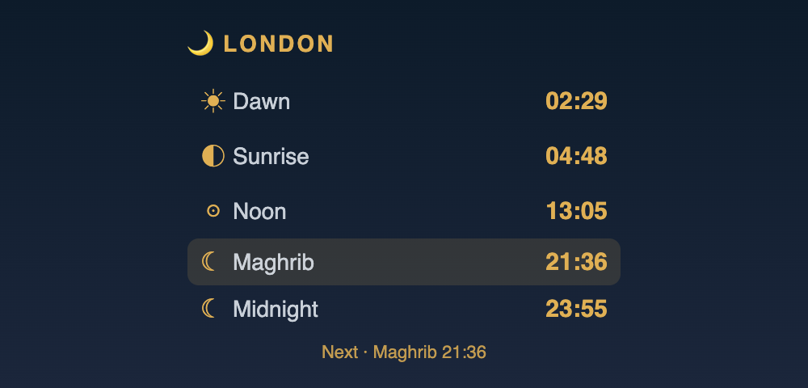

<div align="center">

# 🌙 IC‑EL Prayer Time Widgets

**A beautiful, display‑only prayer‑times widget for your Homey Pro dashboard, Android home screen, and iOS — one dark‑celestial design, five UK cities, zero alarms.**

[](https://github.com/helloseyedjafari/IC-EL-prayertime-widget/releases/latest)
[](https://github.com/helloseyedjafari/IC-EL-prayertime-widget/actions/workflows/ci.yml)
[](https://github.com/helloseyedjafari/IC-EL-prayertime-widget/releases)
[](LICENSE)




</div>

Each widget shows today's **Dawn · Sunrise · Noon · Maghrib · Midnight** for a chosen
city, the city name, and a static **next‑prayer** label. Data comes straight from the
[Islamic Centre of England timetable](https://ic-el.uk/prayer_times/) — no server, no
API key, no account.

Cities: **London · Cardiff · Glasgow · Manchester · Newcastle** (default London).

---

## ⬇️ Download the latest build

Every [release](https://github.com/helloseyedjafari/IC-EL-prayertime-widget/releases)
attaches ready‑to‑use files. Grab the newest with these permanent links:

| Platform | Latest download |
|----------|-----------------|
| 🤖 **Android** — release APK ⭐ | [`PrayerTimes-release.apk`](https://github.com/helloseyedjafari/IC-EL-prayertime-widget/releases/latest/download/PrayerTimes-release.apk) |
| 🤖 **Android** — debug APK | [`PrayerTimes-debug.apk`](https://github.com/helloseyedjafari/IC-EL-prayertime-widget/releases/latest/download/PrayerTimes-debug.apk) |
| 🍏 **iOS** (Scriptable script) | [`prayer-times.scriptable.js`](https://github.com/helloseyedjafari/IC-EL-prayertime-widget/releases/latest/download/prayer-times.scriptable.js) |
| 🟦 **Homey Pro** (app source zip) | [`PrayerTimes-homey-app.zip`](https://github.com/helloseyedjafari/IC-EL-prayertime-widget/releases/latest/download/PrayerTimes-homey-app.zip) |

> **Want a specific version?** Open the
> [Releases page](https://github.com/helloseyedjafari/IC-EL-prayertime-widget/releases),
> pick a tag (e.g. `v1.0.0`), and download that release's assets. The `latest/…` links
> above always point at the most recent release.

---

## 📲 Install

### 🤖 Android

**📥 Download the APK:**

- ⭐ **Release** (signed, recommended) → [**PrayerTimes-release.apk**](https://github.com/helloseyedjafari/IC-EL-prayertime-widget/releases/latest/download/PrayerTimes-release.apk)
- **Debug** → [**PrayerTimes-debug.apk**](https://github.com/helloseyedjafari/IC-EL-prayertime-widget/releases/latest/download/PrayerTimes-debug.apk)

**Install it (no Android Studio):**

```bash
adb install PrayerTimes-release.apk
```

Or copy the APK to your phone and tap it (allow *“install from this source”*).

**Then open the “Prayer Times” app** (it has its own home‑screen/app‑drawer icon). It
shows **today’s times as a table** with a tappable **city switcher** at the top; the
**➕ Add widget to Home screen** button and instructions sit at the bottom.

**Or add it manually / from source:**

```bash
cd android
./gradlew installDebug        # build & install from source to a connected device
```

Long‑press the home screen → **Widgets** → **Prayer Times** → drop it. The widget is
**resizable from 2×2 up to a large card** and refreshes every ~6 h via WorkManager.
**Tap the widget any time to change its city** (or long‑press → Reconfigure). Add
several widgets for different cities — each remembers its own.

### 🍏 iOS — Scriptable

Install **[Scriptable](https://scriptable.app)** (free) from the App Store, then use
either method.

**⭐ Method A — one‑time installer (easiest).** Nothing to download or hunt for:

1. Open Scriptable → tap **+** (new script).
2. Copy the whole installer below and paste it in:
   <br>👉 **[`ios-scriptable/install.js`](ios-scriptable/install.js)** — open it, tap
   **Copy raw file** (the icon at the top‑right of the code box on GitHub), paste into Scriptable.
3. Tap **▶︎ Run** once. It downloads the widget and creates a **"Prayer Times"** script for you.
4. Delete the installer if you like. (Re‑run it any time to update.)

**Method B — paste the script directly.** Copy the **code** (the file's contents, ~230
lines — *not* the file itself):

1. Open the raw script → **[prayer‑times.js (raw)](https://raw.githubusercontent.com/helloseyedjafari/IC-EL-prayertime-widget/main/ios-scriptable/prayer-times.js)**.
2. In Safari, tap and hold → **Select All** → **Copy** (or use the **Copy raw file** button on
   the [file page](https://github.com/helloseyedjafari/IC-EL-prayertime-widget/blob/main/ios-scriptable/prayer-times.js)).
3. In Scriptable: **+** new script → name it **Prayer Times** → paste → **▶︎ Run** to preview.

#### 📌 Then (both methods) — put it on your home screen

Having the **Prayer Times** script in Scriptable is not enough on its own — you still
have to place a Scriptable **widget** and point it at that script:

1. **Long‑press an empty spot** on the home screen until the icons jiggle.
2. Tap the **➕** in the top‑left corner.
3. Search for and select **Scriptable**.
4. Swipe to choose a size (**Small / Medium / Large**) → tap **Add Widget**.
5. Tap **Done**, then **tap the new (blank) Scriptable widget** to open its settings
   (or long‑press it → **Edit Widget**).
6. **Script** → choose **Prayer Times**.
7. **Parameter** → type a city: `London`, `Cardiff`, `Glasgow`, `Manchester`, or
   `Newcastle` (leave blank for **London**).
8. Tap anywhere outside to finish — the times appear.

**To set / change the city (two ways):**
> - **Tap the widget** (or run the script in the app) → a **“choose city”** menu pops
>   up. Pick one; the widget updates on its next refresh. Easiest — no typing.
> - **Or** set the widget’s **Parameter** (Edit Widget → Parameter = `Glasgow`). A
>   Parameter, if set, always wins for that widget — handy for several cities side by side.
>
> Small = all five compact; Medium / Large = glyphs + a `Next · …` tag.
> More: [`ios-scriptable/README.md`](ios-scriptable/README.md).

### 🟦 Homey Pro

The widget lives inside a small Homey app you install on **your own** Homey Pro in
developer mode (nothing is published to the Homey App Store).

```bash
npm install -g homey            # Homey CLI
homey login                     # your (free) Homey account
cd homey
homey app install               # builds + installs onto your Homey Pro
```

Then on your Homey **dashboard**: add a widget → **Prayer Times** → open its settings
→ pick a **City**.

> **Daily auto‑update without touching the screen.** The app backend refreshes on its
> own (hourly + a precise 00:05 London rollover) and *pushes* new times to the widget,
> so an always‑on dashboard updates itself even though dashboard widget timers get
> throttled when idle. To try it live first: `cd homey && homey app run`.

More: [`homey/`](homey/) and design spec §6.4.

---

## ✨ Why it's nice

- **Display only.** No alarms, notifications, or audio. The next‑prayer label is static
  — it never ticks.
- **One design, three platforms.** Deep‑navy → indigo gradient, warm gold accents, a
  glyph per prayer, the next prayer subtly highlighted.
- **Correct by timezone.** “Today” and “now” are always computed in `Europe/London`.
- **Resilient.** Each widget caches the last good times per city; if the source is
  unreachable it shows those (with a dim dot) instead of a blank card.
- **Self‑healing data.** The source occasionally emits a bad `00:00` for
  dawn/sunrise/noon — the parser repairs it by interpolating the neighbouring days.

---

## 🧠 How it works

All three widgets fetch the same monthly HTML table and read today's row:

```
https://ic-el.uk/wp-content/icel/praying_timetable/prayer_times_en.php?year=YYYY&city=CITY&month=M
```

The parsing rules live once in [`shared/parsing-contract.md`](shared/parsing-contract.md).
The reference implementation is the JS core `shared/prayer-core.js` — reused directly by
Homey and iOS, and ported to Kotlin (`android/.../PrayerCore.kt`). All are covered by
tests against saved fixtures (including the Cardiff `00:00` repair case).

| Path | What |
|------|------|
| [`shared/`](shared/) | Canonical parser, parsing contract, HTML fixtures, tests |
| [`homey/`](homey/) | Homey Pro app + dashboard widget |
| [`ios-scriptable/`](ios-scriptable/) | Single Scriptable script |
| [`android/`](android/) | Android Studio project (home‑screen widget) |
| [`docs/superpowers/`](docs/superpowers/) | Design spec + implementation plan |

---

## 🛠️ Development

```bash
npm test                                     # shared JS parser tests (Node, zero deps)
cd android && ./gradlew testDebugUnitTest    # Kotlin parser parity tests
```

CI runs both on every push/PR to `main`.

### Cutting a release

Tag the repo and push the tag — the [release workflow](.github/workflows/release.yml)
builds everything and publishes a GitHub Release with the assets above:

```bash
git tag v1.0.0
git push origin v1.0.0
```

---

## 📜 License

[MIT](LICENSE). Prayer‑time data belongs to the
[Islamic Centre of England](https://ic-el.uk); this is an unofficial, display‑only
client and is not affiliated with or endorsed by them.
